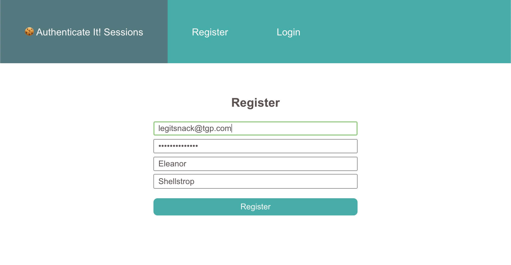

# Authenticate It! 🔐

## Learning Objectives

Today we'll implement two modes of authentication: session-based authentication and token-based authentication. For an in-depth refresher of the two of them, you can check out this [video](https://www.youtube.com/watch?v=2PPSXonhIck).

## Getting Started

### Sessions

First, we'll tackle authentication with sessions! 🍪 `cd` Into the `server/server-session` and `client/client-session` folders and install dependencies with `npm i`. You'll also want to use Nodemon to easily monitor your server. You will also need to have `mongodb` up and running at the default port.

From the `client/client-session` directory, run the `npm start` command to start the client, and from the `server/server-session` directory, run the `nodemon index.js` to start your backend server.

Most of the client side as well as the server is already set up for you. 🚀

On the server side, you will need to implement authentication middleware and the logic for the controllers. It's possible to implement sessions manually, but we recommend using the `express-session` library for this exercise.

⚠️ Remember to hash your passwords before saving them to your database!

The `/me` and `/logout` routes should be protected by an auth middleware; that is, unauthenticated requests should not be able to query these endpoints. Try using POSTMAN to check requests are working, and once this is set up, you can connect the client requests to the server.

### JWT

After you finish session-based auth, remember to stop all your servers and navigate to the `server/server-jwt` and `client/client-jwt` folders. Install dependencies with `npm i`.

Now you're ready to implement authentication once again using a different strategy: JSON Web Tokens!🏅 For a brief explanation of how JSON Web tokens work, check out [this video](https://www.youtube.com/watch?v=7Q17ubqLfaM). As you work your way through the exercise, you'll realize a lot the authentication logic remains the same: code you implemented in the `session` implementation can be reused here. In what areas will you have to approach things differently? 🤔

## Requirements

These requirements apply to both session and JWT-based authentication. A user should be able to register with email, password, first name and last name. If the email already exists, the client should alert the user and prompt them to try to register again. There should also be a similar alert if the user tries to sign in with an incorrect email or password.

Upon successfully registering or logging in, the user should be redirected to the profile page. Logging out should destroy the session or remove the JWT and redirect the user to the homepage. 🏠

## Extra Credit

### Sessions

- Note that by default, `express-session` saves the session in an in-memory store. This is only approriate for development environments and deployed applications should use session store like `connect-redis` or a separate database. Try to refactor your server to persist sessions in a [session store](https://www.npmjs.com/package/express-session#compatible-session-stores). 🥞

### JWT

- Production implementations of JWT will also use [refresh tokens](https://auth0.com/blog/refresh-tokens-what-are-they-and-when-to-use-them/) along with access tokens. Refactor your implementation to use refresh tokens, too.

### Other

- Try implementing [OAuth 2.0](https://www.varonis.com/blog/what-is-oauth/) with any strategy (Facebook, Google, Twitter, Instagram, etc) for this exercise. You can use [Passport.js](http://www.passportjs.org/) to make things a little simpler. The official docs can be unhelpfully cryptic at times, so you can check [these docs](https://github.com/jwalton/passport-api-docs) for reference.
